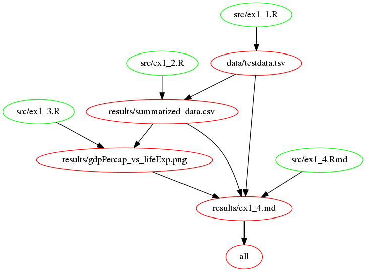

#DSCI_522_lab_3_he_kai

DSCI 522 lab 3 for Kai He (hknaicha)

|directory|file|nature|usage|
|---------|----|------|-----|
|[root](https://github.ubc.ca/ubc-mds-2016/DSCI_522_lab_3_he_kai)|[lab3.md](https://github.ubc.ca/ubc-mds-2016/DSCI_522_lab_3_he_kai/blob/master/lab3.md)|Markdown instruction for lab3|open in Rstudio or view on github|
|[root](https://github.ubc.ca/ubc-mds-2016/DSCI_522_lab_3_he_kai)|[run_all.sh](https://github.ubc.ca/ubc-mds-2016/DSCI_522_lab_3_he_kai/blob/master/run_all.sh)|driver bash script to run all scripts|`bash run_all.sh`|
|[root](https://github.ubc.ca/ubc-mds-2016/DSCI_522_lab_3_he_kai)|[Makefile](https://github.ubc.ca/ubc-mds-2016/DSCI_522_lab_3_he_kai/blob/master/Makefile)|Makefile to run all scripts or clean all results|`make` or `make clean`|
|[root](https://github.ubc.ca/ubc-mds-2016/DSCI_522_lab_3_he_kai)|[dependency.png](https://github.ubc.ca/ubc-mds-2016/DSCI_522_lab_3_he_kai/blob/master/dependency.png)|dependency graph for [Makefile](https://github.ubc.ca/ubc-mds-2016/DSCI_522_lab_3_he_kai/blob/master/Makefile)|Open as png file or view on github|
|||||

