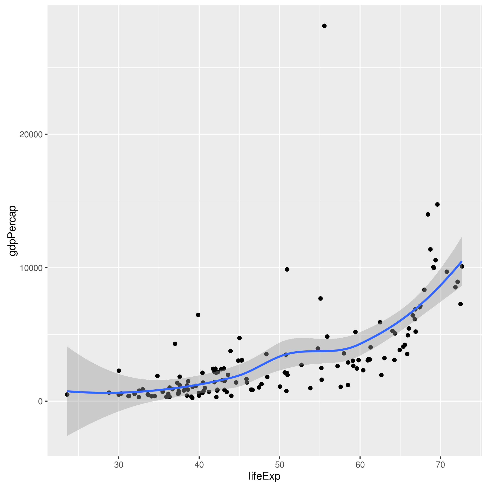

#### Fourth script: an `.Rmd`, actually, that presents original data, the statistical summaries, and/or the figures in a little report.

Read the original data downloaded by ex1_1.R, and stored in the data subdirectory:

```{r}
# put () around to print to screen
(data <- readr::read_tsv("../data/testdata.tsv"))
```

Read the statistical summary table generated by ex1_2.R:

```{r}
(summarized_data <- readr::read_csv("../results/summarized_data.csv"))
```

the figure gdpPercap_vs_lifeExp.png is generated by ex1_3.R:


